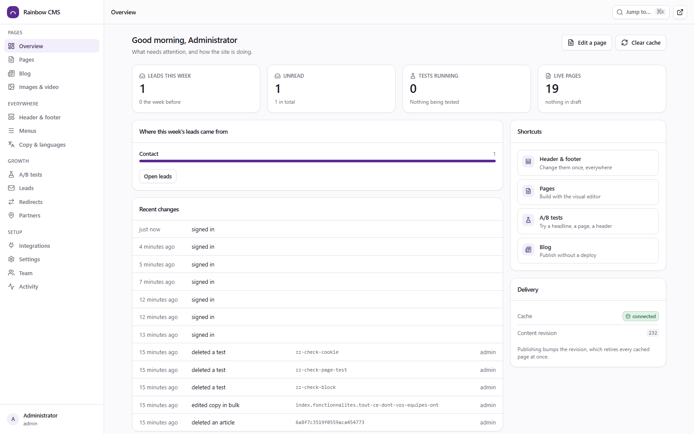
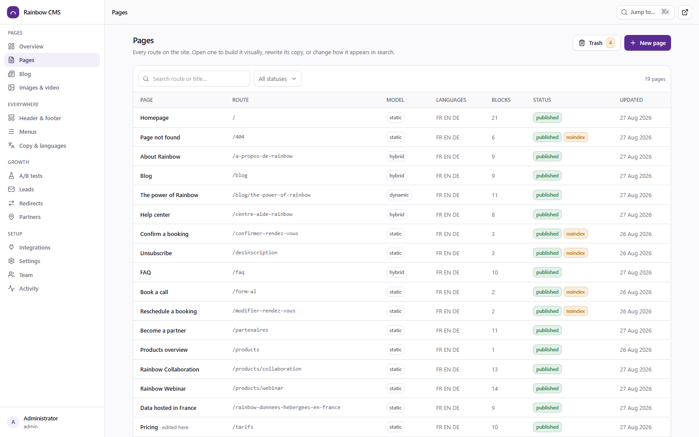
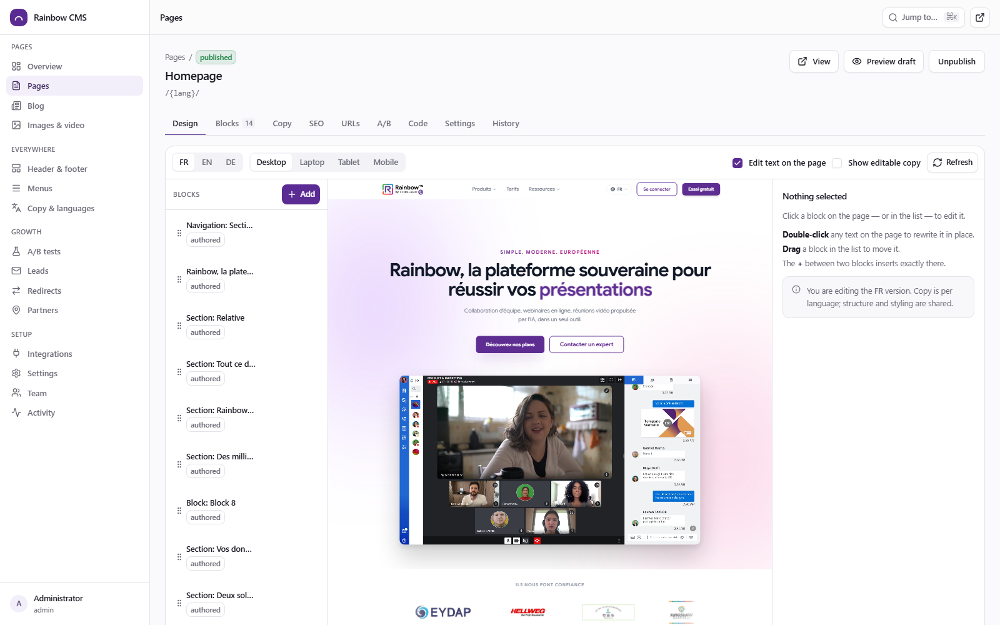
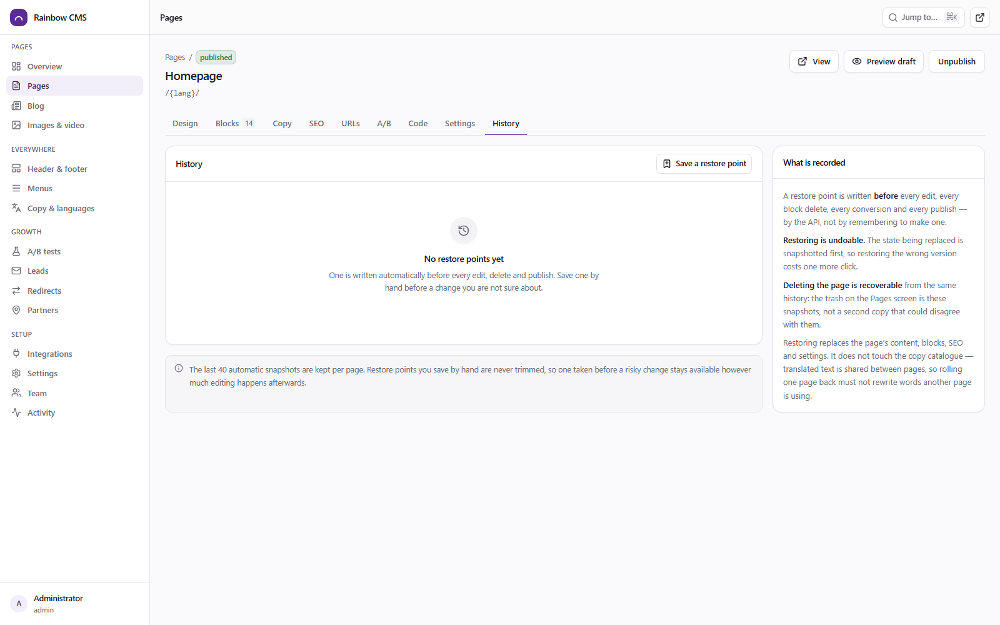
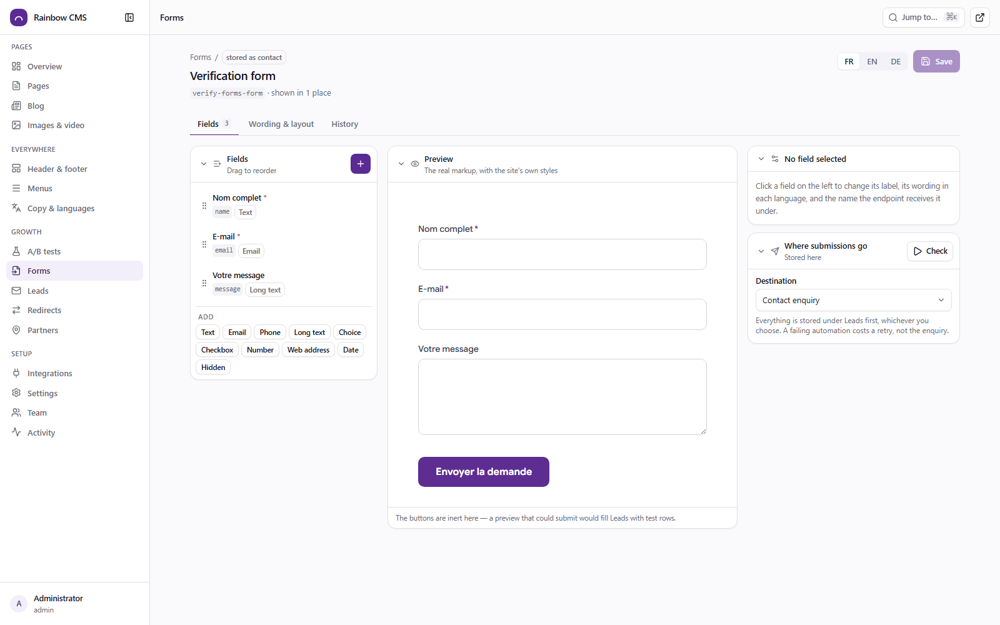
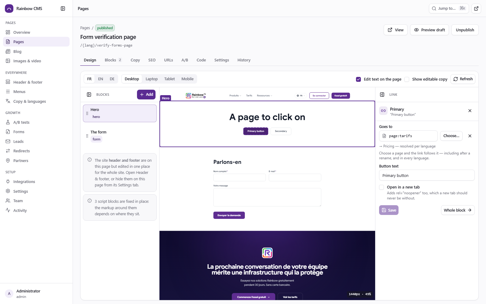
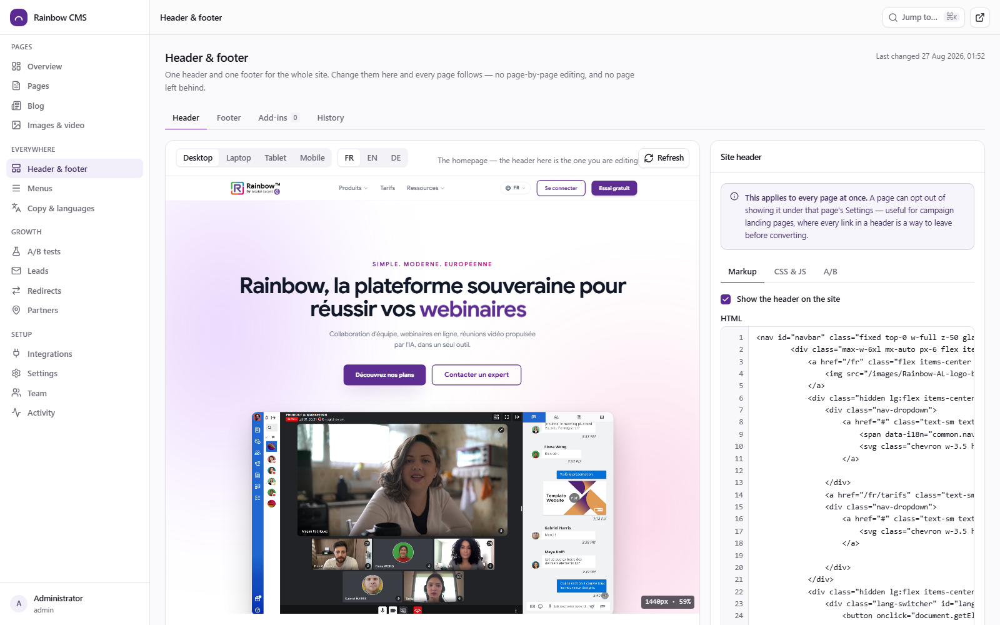
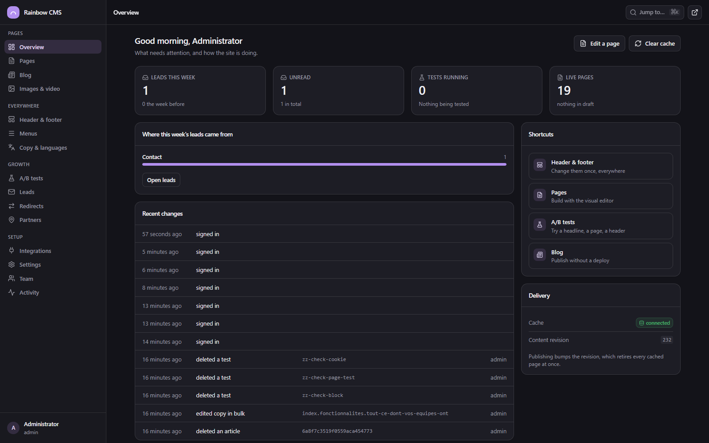

# Rainbow by ALE — site & CMS

The Rainbow marketing site, moved from hand-written static HTML into a
database-backed CMS **without changing a single byte of what a visitor
receives**.

Every page of the original site is served by an Astro 7 server-rendered
frontend, composed from content stored in MongoDB, cached in Redis and edited
through a purpose-built admin. A verification tool proves the equivalence on
every run:

```
$ npm run verify
133 checks, 0 failure(s)

$ node tools/verify-live.mjs http://localhost:8080
54 page renders compared against the authored source, 0 difference(s)

$ node tools/verify-chrome.mjs http://localhost:8080
one header and one footer across 13 pages × 3 languages, 0 upstream URLs exposed

$ node tools/verify-editor.mjs http://localhost:8080 --confirm
158 passed, 0 failed

$ node tools/verify-ui.mjs http://localhost:8080 --confirm
43 checks, 0 failure(s)
```

The last one is a real browser. It signs in, builds a landing page with no header
or footer, drops a form on it, submits that form as a visitor, finds the
submission under Leads, points a button at a page and checks the link resolves
differently in French and German, then breaks the page, restores it from history,
undoes the restore, deletes the page and recovers it from the trash.

`verify-live` distinguishes a page whose **markup** has drifted from one whose
**copy** was edited in the CMS: on a difference it re-renders against the
catalogue the API is serving, and reports an edit rather than a failure when that
matches. Without that, the tool would go red the first time anyone changed a word
and be switched off by the end of the week.

Editing is visual — the canvas is the real page in an iframe, so what an editor
sees is not a preview of what ships, it is what ships. Blocks are clicked and
dragged; copy is rewritten in place; the advanced block takes your own HTML and
Tailwind. None of which costs the guarantee above.

---

## What this is

| | |
|---|---|
| **Frontend** | Astro 7, SSR on the Node adapter — one route file serves every page in every language |
| **Content API** | Express 5 + Mongoose 9, JWT auth, role-based access, Redis read-through cache |
| **CMS** | React 19 + Vite 8 single-page admin, built on Tailwind 4 and shadcn/ui primitives: pages, blocks, copy, media, blog, navigation, leads, A/B tests, restore points |
| **Data** | MongoDB 8 |
| **Cache** | Redis 7, invalidated by a site-wide revision counter on publish |
| **Delivery** | Docker Compose with an nginx gateway; one origin for site, admin and API |

---

## Getting started

```bash
cp .env.example .env          # then change every secret in it
docker compose up -d --build  # mongo, redis, api, web, cms, gateway
docker compose exec api node apps/api/src/seed/seed.js
```

| | |
|---|---|
| Site | <http://localhost:8080/> |
| CMS | <http://localhost:8080/admin/> |
| API | <http://localhost:8080/api/v1/> |

Sign in with the `ADMIN_EMAIL` / `ADMIN_PASSWORD` from `.env`. The account is
created on first boot, only when the database is empty.

### Working on it locally

```bash
docker compose -f docker-compose.yml -f docker-compose.dev.yml up -d mongo redis
npm install
npm run seed
npm run dev        # api :4000, web :3000, cms :5173
```

---

## How the migration works

The original site was 18 hand-authored HTML pages plus three translation
catalogues, rendered by splicing translated copy over marked-up byte ranges.
That splice is the seam this CMS is built on.

```
content-source/pages/*.html          the authored templates (French, with data-i18n markers)
content-source/i18n/*.json           the copy, per language
        │
        │  seed  ──  packages/core/src/ingest.js
        ▼
MongoDB
  pages          document scaffolding + an ordered array of section blocks
  contentstrings 1 521 strings × 3 languages, addressed by key
  navigations    navbar and megamenus, per language, drag-ordered
  blogposts      the dynamic content type
  media          uploads + an index of the images that ship with the build
  partners       1 130 entries behind the partner locator
        │
        │  render  ──  packages/core/src/compose.js
        ▼
Astro SSR  →  the same bytes the static site served
```

Three things make that round trip lossless:

1. **HTML is never re-serialized.** The scanner returns byte ranges and the
   renderer splices over them. A parser would normalize quoting and whitespace
   and silently reformat every page.
2. **Blocks hold authored bytes.** Slicing the body into top-level children
   keeps the whitespace that preceded each one, so concatenating the blocks
   reproduces the body exactly — which `tools/verify-fidelity.mjs` asserts.
3. **A page of only authored blocks is emitted as one fragment.** Astro puts a
   newline between sibling template nodes; joining first avoids it.

### What the CMS owns

| Owned by the CMS | Owned by the code |
|---|---|
| Every visible string, in every language | The markup structure and its classes |
| Page metadata, OG fields, JSON-LD overrides | The stylesheets and page scripts |
| Section order, visibility, duplication | Which section a block's markup renders |
| The URL of every page, per language | How a URL is resolved to a page |
| Navigation labels, links, megamenu zones | The megamenu's layout and behaviour |
| Blog posts, media, partner directory | The article template's shape |
| Site-wide and per-page code (add-ins) | |
| Which page a link points at | Where that page lives, per language |
| Lead-capture forms and where they send | The proxy that makes the call |
| A/B experiments and their variants | |
| Custom blocks: their HTML, Tailwind and scoped CSS | |

---

## Editing

The **Design** tab is a visual page builder. The canvas is an iframe of the real
page — the same CSS, the same browser-compiled Tailwind, the same page scripts —
so what an editor is looking at is not a preview of the page, it is the page.

It lists the page's **body only**, and the header and footer are not editable
from it at all — clicking either one in the canvas says where it *is* edited
rather than opening an inspector for something the page does not own. That was
the mistake consolidating them was meant to end: opening one page to change the
footer, and being surprised when it changed on all of them. A page can still hide
either from its own Settings.

The canvas renders at a **real device width** — Desktop is 1440px, scaled to fit
the column. Before that it got whatever width was left over, about 700px, which
is under the site's `lg:` breakpoint: so "Desktop" was quietly showing the
*mobile* header on both this screen and the header editor.

```
click a block          select it, inspector opens on the right
double-click text      rewrite it in place, in the language you are viewing
drag in the list       reorder
+ between two blocks   insert exactly there
Desktop/Tablet/Mobile  resize the canvas
```

Blocks come from a palette that shows each one's shape and says when to use it,
grouped as openers, content, proof, conversion and advanced.

### Getting out of trouble

Every page, article, menu, the header and footer, and the site settings carry a
**History** tab. Not a changelog — a list of moments this thing can be returned
to, what changed at each, and a button.

```
before the autumn campaign rewrite     saved by hand · 2 hours ago · Aïcha
  published · 11 blocks · /tarifs
  Restoring this changes: title, 2 blocks removed
```

Three things make it an undo rather than a museum piece:

- **The API takes the snapshot, not you.** Before every edit, every block
  delete, every conversion and every publish. A history that depends on somebody
  remembering to press "back up first" is empty on the day it is needed.
- **You can name one.** *Save a restore point* records the current state under a
  name — "before the autumn campaign rewrite" — and named points are never
  trimmed, however much editing happens afterwards. Automatic snapshots cover
  the accidents; this covers the deliberate risk.
- **Restoring is undoable.** The state being replaced is snapshotted first, so
  restoring the wrong version costs one more click rather than a second panic.

A **deleted page** comes back from **Pages → Trash**, as a draft, with its blocks
and its SEO. The trash is those same restore points rather than a second copy
that could disagree with them — and the snapshot before a delete is written
unconditionally, because that is precisely the moment it is the only copy left.

### Forms

**Forms** is its own screen, because a form is a thing rather than a property of
the block that shows it. The demo-request form appears on four product pages; it
should be one form, changed once — not four block-local copies that drift apart
until one of them is still asking for a fax number.

The builder is three columns:

| | |
|---|---|
| **Fields** | Drag to reorder, click to configure, add from a row of types |
| **Preview** | The real markup, inside a frame of the site, with the site's own stylesheet — so what you see is not an approximation |
| **This field / Where it goes** | One panel at a time, folded away when you do not need it |

The distinction the panel exists to make obvious is the one that trips everybody
up. A field has a **label**, which is what a visitor reads and is different in
every language, and a **name**, which is what the endpoint receives and has to be
exactly what the automation expects. Send `Adresse e-mail` to a workflow reading
`email` and the submission is refused for every visitor.

So the CMS checks. Every automation endpoint on this site answers an unusable
payload by naming the fields it was missing; the Integrations screen records that
answer, and **Check** compares your form against it:

```
Missing 3 required fields
The endpoint refuses a submission without companySize, country, consent.
```

Before the form goes on a page, and without submitting anything. When nobody has
tested that endpoint yet it says *not checked* rather than showing a green tick —
a check that is confidently wrong is worse than no check.

Where a submission goes is one dropdown:

| | |
|---|---|
| **Leads → demo** | Stored under Leads, filed as a demo request |
| **An integration** | Stored *and* forwarded, server-side, to whatever runs the follow-up |

Stored first, always. A form whose automation is misconfigured still captures
the lead, and the CMS says the integration is failing instead of losing enquiries
quietly for a fortnight. The browser only ever posts to this origin, so the
automation platform stays out of the page source — see **Integrations** below.

The honeypot is not optional and not editable: a field a human never sees and a
bot always fills, answered with a 202 so the bot learns nothing.

**Where a form can go.** A **Form** block on any page, or a **Form** section
inside a blog article. Both render through one function, so a form cannot look or
behave differently depending on where it was placed. A block can still define its
own fields for a genuine one-off — choosing a saved form folds that away, because
the two are alternatives and filling in the half that is ignored is a trap.

Deleting a form that four pages show is refused, and the refusal names them. A
dangling reference renders as an HTML comment naming the missing form: visible to
whoever opens the preview, invisible to a visitor, and never a silent gap.

What forms deliberately are **not**: the booking calendar, the reschedule wizard
and the token-confirmation pages. Those are multi-step flows with a slot picker
and a lookup-then-confirm handshake, not field lists. Pretending a field list
could express them would produce a builder that half-works on the four hardest
pages on the site, so they stay as authored pages.

### Clicking a button to change where it goes

On the **Design** tab, click any button or link on the page. A panel opens with
that one element: where it goes, what it says, and whether it opens in a new tab.

That is the edit people actually make — "that button still points at the old
pricing page" — and finding `secondaryHref` among eighteen fields of a block
whose name you have to guess from the layout is a worse experience than editing
the HTML was.

The panel is honest about three different situations:

| What you clicked | What you get |
|---|---|
| A link the block drew from one of its fields | Its destination, its label and a new-tab option |
| A label whose destination is not yours to choose — the blog list's button goes to the blog | The words, and one line saying why the destination is fixed |
| A link written inside an authored section's own markup | Its destination, spliced over that one attribute's bytes so the rest of the section stays exactly as it was authored |

That last row is the interesting one. The imported pages are stored as the bytes
they were written with and a verification tool proves the site still ships those
bytes, so "let an editor fix a link" cannot mean re-serialising the section: a
parser would normalise the quoting and rewrite two hundred lines to change nine
characters. Instead the anchor is found by scanning, the `href` value's byte range
is replaced, and everything around it is untouched.

**Open in a new tab** always writes `rel="noopener noreferrer"` with it. Somebody
ticking a checkbox is not choosing to hand the new tab a live reference back to
the page that opened it.

Clicking a field inside a form does not edit it here. It says which form the
field belongs to and offers to open it, because that form may be on four pages
and changing it from one of them without saying so is how a CMS loses trust.

### Panels that fold

The sidebar collapses to its icons, both rails of the visual editor fold, and
every panel on the form builder has a chevron. Each remembers its own state, so a
layout you arranged for the job you are doing survives the next navigation and
the next session.

The canvas is why. At 1440px the three-column editor scales a desktop preview to
roughly half size, which is unreadable for the one thing a preview is for.

A closed inspector still opens itself when you select a block — a click that
worked and appeared to do nothing would be worse than no fold at all.

### Links that follow a rename

Every button, link and menu entry is chosen rather than typed:

```
Page          → page:tarifs        resolved to /fr/tarifs, /de/preise, per render
Article       → post:the-slug
On this page  → #pricing           the anchors that actually exist on this page
Web address   → https://…
Email, phone  → mailto:, tel:
File          → the media library's reference
```

A page is stored **by name**, not by path. One stored value is therefore correct
in every language, and stays correct when the URL changes — which matters because
renaming a URL is a thing this CMS actively encourages (it writes the redirect
for you), and a hand-typed path would quietly start costing a redirect hop on
every click.

A path typed by hand still works. It just says so, underneath the field.

### The custom block

The advanced block is your own HTML, with Tailwind. The site loads Tailwind from
the CDN and compiles classes in the browser, so any utility class works with no
build step between writing it and seeing it. Its optional stylesheet is scoped to
the block before it is emitted — `.card {}` becomes `.cms-block-<key> .card {}` —
so a selector cannot reach out and restyle the rest of the page. Five starting
points (two columns, three cards, gradient banner, testimonial, blank) are
written in the site's own theme, so a starter looks like a Rainbow section before
you change a word.

### Header and footer

One header and one footer for the whole site, under **Header & footer**. Change
them there and every page follows.

They used to live *inside* each page — eighteen copies. The markup was the same
everywhere; what differed was the translation key on each string, because the
extractor minted a fresh key every time it met the same sentence on a new page.
In French that was invisible. In English and German it was not: `verify-chrome`
found **thirteen different footers** in each of those languages, because only
some of the duplicate keys had ever been translated. Consolidating fixed that.

Every breakpoint is one click away — Desktop, Laptop, Tablet, Mobile — and so is
every language, because a header has a different design at each width and
different copy in each language.

Each part takes its own CSS and JavaScript, and can be A/B tested — a header test
runs on every page, so it reaches full traffic fast, and for the same reason it
makes the whole site uncacheable while it runs. The interface says so.

**Restore original** puts a part back to the markup the site was migrated with.
That is what makes the header safe to hand to a marketer: the worst case is one
click from being undone.

A page can opt out under its own **Settings** — a campaign landing page usually
should, since every link in a navigation bar is a way to leave before converting.

### Images

An image in the library has two things a filename does not: a **name** you can
change freely, and a **reference** pages point at.

```
stored in the page   
sent to the browser  
```

Because pages hold the reference, **replacing an image updates every page that
uses it** — one upload instead of hunting through nine pages for a hard-coded
URL, and without the ones nobody remembers keeping the old picture.

The indirection is resolved on the server, so a visitor still gets one request
for a content-hashed file that caches for a month. There is no redirect on the
hot path; `/media/a/<slug>` also resolves on its own, as a fallback for a
reference that escaped the render pass.

The library shows, for every image:

| | |
|---|---|
| **Where it is used** | Split into uses **by reference** (which follow a replacement) and **by filename** (which do not) |
| **Replace** | Keeps the reference. The previous file goes to history, and **Put back** undoes it |
| **Rename** | The old reference is kept as an alias, so nothing breaks and the tidy-up is optional |
| **Alt text** | Per language, described once here rather than retyped on every page |

Deleting an image that pages still use is refused, with the list of places, since
the alternative is a broken image on each of them.

The site was migrated with hard-coded filenames, so those uses start out pinned.
**Make it managed** gives an image a reference and repoints every occurrence
across pages, articles and the chrome at it — after which replacing the file is
enough. The seed names all 160 bundled images on first run.

Picking an image through the library — the picker in any block, or **Insert
image** in a code editor — stores the reference, so the managed path is the
default rather than the disciplined choice.

### Add-ins

Named snippets injected on every page: a chat widget, a consent banner, a
campaign pixel. Each has a name, a note, an on/off switch, an optional page
filter and its own A/B key.

Settings used to have three anonymous "global snippet" textareas. Nobody dared
touch them and nobody knew what was in them. The difference is not the
capability, it is that in two years somebody can tell what this one was for.

Those three fields are gone. Anything in them is migrated into named add-ins on
first boot — switched **on**, because they were running, and a migration that
silently disabled a consent banner would be a worse bug than the one it fixed.

### Blog articles

An article body is an ordered list of **sections**, not one HTML box. That
matters for one reason: the *Sommaire*. A contents list built by scanning
rendered markup for headings can only guess — it cannot know that this `h2` is a
chapter and that one is the label on a summary box. Here each section says
whether it belongs in the contents and under what name, so the list is a fact
about the article rather than an inference from it.

```
Heading      a chapter. In the contents by default.
Text         paragraphs and lists
Key points   the blue summary box. In the contents by default.
Image        a figure with a caption
Pull quote   emits Quotation structured data
Callout      a tip, an aside, a warning
Video        YouTube or any embed
Custom       your own HTML with Tailwind, and CSS scoped to the section
```

Drag to reorder, hide a section while you rewrite it, duplicate one. Anchors are
generated from the heading and de-duplicated, so two chapters called
*Conclusion* do not both answer to `#conclusion`.

Articles imported as one block of HTML keep working — the contents list is then
derived from their headings, and **Split into sections** converts one into the
first section, losing nothing.

Three things the article template used to state and now reports honestly:

- the **breadcrumb** is `Home › Blog › Category › Title`, with the category
  linking to the filtered blog. It used to say *Collaboration* on every article,
  linking to an anchor that existed on no page.
- the **contents list** is the article's own chapters. It used to be the same six
  links everywhere, and it is now omitted entirely rather than shown empty.
- **related articles** come from the same category first, topped up with the most
  recent. They used to be three hand-written cards, two of them pointing at
  articles that were never written — which `verify-assets` had been reporting as
  broken links since the migration.

### Publishing

One flow, in the order the work happens: **Write → Configure → Search & sharing**,
then a bar along the bottom that always says the same four things — what state
this is in, whether anything is unsaved, how to look at it, and the one action
that moves it forward.

The primary button changes with the state, because the interesting question is
never "do you want to save" but "will people see this": *Publish*, *Publish
changes*, *Save draft*. Publishing with unsaved edits saves first, since
otherwise the button puts the *previous* version live.

The steps carry a count of what is unfinished, and the problems are stated as
consequences rather than rules — "no cover image: it is the hero, the card
thumbnail and the sharing image", not "field required".

### Seeing it before you publish

Character counters do not tell you what a link looks like. The **Search &
sharing** step renders the real thing, from the values the page will emit:

| | |
|---|---|
| **Tab** | A browser tab, which shows about 30 characters — not 60 |
| **Google** | ~60 of the title, ~155 of the description, with the path |
| **X** | The 1.91:1 card, so you can see what gets cropped |
| **WhatsApp** | The small square thumbnail in a real message bubble |
| **LinkedIn** | Which ignores the description on most cards |

Each one says what it would do differently — where Google will cut the title,
that WhatsApp's crop makes text inside an image unreadable, that a link with no
image gets markedly fewer clicks. The same previews sit in a page's SEO tab.

### The imported pages

The eighteen migrated pages are stored as the exact bytes they were authored
with, and `verify-live` proves the site still ships those bytes. In the builder
their **copy** is fully editable — that is what the string catalogue is for — and
they can be hidden, reordered and given anchors.

Changing their **structure** is a different matter, so it is an explicit choice
rather than a side effect: *Convert to a custom block* moves the markup into a
custom block, where it gains Tailwind, spacing controls and A/B variants. The
dialogue says plainly that the section leaves the byte-fidelity guarantee, and
the previous version stays in the page's history. Sections nobody converts keep
passing `verify-live` unchanged.

### On-page check

The SEO tab reads the **rendered page** rather than scoring the form you just
filled in — title and description length against what search results actually
show, H1 count, heading order, missing alt text, canonical, hreflang coverage,
JSON-LD validity, social image, thin copy. Every check is one you would act on.

---

### The admin itself

| | |
|---|---|
|  |  |
| The overview: what is broken, what is unpublished, what came in | Every route, with landing pages and drafts marked |
|  |  |
| The builder — the canvas is the real page in an iframe | History: the way back out of a mistake |
|  |  |
| The form builder: fields, the real markup with the site's own styles, and where submissions go | Click a button on the page and change where it points |
|  |  |
| One header and one footer, at a real device width | And the same thing in dark |


Built on Tailwind 4 and the shadcn/ui contract — Radix primitives for behaviour,
semantic colour tokens for the skin — in `apps/cms/src/components/ui/`. Every
screen imports from there and nothing else, which is what keeps twenty screens
looking like one product rather than twenty.

What that buys, concretely:

| | |
|---|---|
| **Light and dark** | Every colour is a token pair, so the theme switch is one class on the root. Follows the operating system by default |
| **⌘K** | Jump to any screen, page or article by name |
| **Real dialogues** | Confirmations say what will happen — "a restore point is written first, so this is recoverable" — rather than `localhost:8080 says:` |
| **Keyboard and screen readers** | Radix handles focus trapping, `aria-*` and roll-your-own-listbox bugs, which is most of what hand-built admin widgets get wrong |
| **No layout jump on save** | A refetch keeps the previous data on screen instead of unmounting behind a spinner |

`npm run ui:shots` photographs every screen in both themes into `artifacts/ui/`,
and CI keeps them as a build artefact — a visual regression is much easier to see
than to describe.

## Page types

Straight from `reco.md`:

- **Static** — structure in the codebase, content spliced in. Homepage,
  products, pricing. A/B testable at the section level.
- **Dynamic** — one template, content entirely from the database. Blog posts;
  publishing needs no deploy.
- **Hybrid** — an authored skeleton with database-driven slots. The blog index,
  the FAQ, the partner locator.

A page's type is metadata, not a code path: any block can go on any page.

---

## SEO

Everything is server-rendered — there is no client-side content on this site.

### URLs

One page, one URL per language. Each page has a shared path plus optional
per-language overrides, edited under its **URLs** tab:

```
/fr/tarifs        /en/pricing        /de/preise
/fr/blog/{slug}   /en/blog/{slug}    /de/blog/{slug}
```

- A visitor arriving on the untranslated path gets a **301** to the language's
  own path — never a second copy of the page competing with the first.
- Renaming a URL **writes the redirect for you**, and repoints anything that
  already pointed at the old path so no redirect chain builds up. Forgetting
  that redirect is the most expensive mistake a CMS can let you make, so it is
  not left to whoever edits next.
- `canonical`, `hreflang` and the sitemap are built from the same resolver, so
  they cannot disagree with each other.
- The blog's own segment is per language too, under **Settings → Languages**.

### Tags

- `canonical` is always the current locale's URL, never cross-locale.
- `hreflang` lists only the locales a page actually exists in; `x-default`
  points at English. A missing translation gets no entry rather than a
  misleading one.
- JSON-LD is generated per page type (Organization + WebSite on the homepage,
  SoftwareApplication on products, Blog on the index, Article on a post) plus a
  `BreadcrumbList` on every page, and can be extended or replaced from the CMS.
  Breadcrumb trails only list intermediate levels that are real pages — pointing
  a crawler at `/fr/products/` because something lives beneath it would point it
  at a 404.
- `?version=` campaign entry points emit `noindex, nofollow`, are excluded from
  the sitemap, and are disallowed in `robots.txt`.
- `sitemap.xml` covers every locale of every indexable page plus published
  articles, at their localized paths, with `xhtml:link` alternates.

---

## A/B testing

Variants are assigned in Astro middleware, **before** the page renders, and
stored in a cookie for the experiment's window. The HTML a visitor receives
already is their variant: no flash, no layout shift, no hydration mismatch, and
a crawler sees an ordinary page.

Three scopes:

- **A block.** Any block, of any kind. A component block varies by *field
  override* — a variant states only what it changes, merged over the control, so
  testing one headline does not mean restating the whole hero. Authored and
  custom blocks vary by markup.
- **A whole page body.** Duplicate the page as arm B, change whatever you like,
  split the traffic. The arm has no URL of its own: its content is served at the
  control's address, so there is one canonical URL and nothing duplicate in the
  index. Arms are `noindex` and excluded from the sitemap. Only the body varies —
  the header and footer come from the shared chrome either way.
- **The header, the footer, or an add-in.** Site-wide, so the test reaches full
  traffic in a fraction of the time a single page's would.

Two modes:

- **cookie** — weighted split, persisted (14 days by default), for real tests.
- **param** — `?version=b` for ad campaigns. Session-scoped, never indexed.

An assignment is only *persisted*, and shared caching only suppressed, for the
experiments a page actually used. Otherwise a test on one page would cookie every
visitor on every page and force the whole site to be served `private`.

The assignment is exposed as `window.__CMS__.variants`, and a page-level arm as
`window.__CMS__.page.variant`, so analytics and session recording can be
filtered by variant.

---

## Integrations

The forms used to post straight from the visitor's browser to the automation
platform that runs the lead flow. Three things followed, none of them good: the
platform and every webhook path were readable in the page source of a public
marketing site; the endpoints could be hammered without ever loading the site;
and the platform's raw reply — internal ids, execution URLs, error text — was
handed to anyone with the network tab open.

Now the browser posts to a path on this origin and the server makes the call:

```
before   fetch('https://<automation-host>/webhook/livre-blanc-lead', …)
after    fetch('/api/v1/hooks/livre-blanc-lead', …)
```

The substitution happens **at render time**, from the mapping in the CMS, so the
authored templates still say what they always said and nothing had to be
rewritten by hand. It is the same class of transformation as the locale prefix
the renderer already puts on internal links.

What the browser gets back is the smallest true thing:

- `ok` — whether it worked, and nothing else. The default.
- `fields` — that, plus an allowlist of keys named on the integration. The
  booking calendar needs `slots`; it does not need the execution URL.

There is no pass-everything mode.

Other properties worth knowing:

- **Nothing is lost.** A submission is stored under **Leads** *before* the
  outbound call, so an automation that is down, mid-deploy or misconfigured
  costs a notification, not a lead.
- **Health is visible.** Call and failure counts, last status and last error sit
  on the Integrations screen, so "is this form working?" does not mean logging
  into the automation tool. Failures surface on the dashboard.
- **Internal addresses are refused.** An endpoint must be a public URL — private
  ranges, loopback and the compose service names are rejected, so this cannot be
  turned into a probe for the network the API sits in.
- **The upstream URL is never returned by a public route.** The admin screen
  shows the host and a path hint, never the full URL. The renderer reads the map
  over a server-only endpoint gated by the shared secret.
- `content-source/integrations.json` seeds the mapping and lets the verification
  tools reproduce the substitution without holding any credential.

### What each endpoint actually wants

**Test** on the Integrations screen does not send a plausible submission — it
sends a deliberately invalid one, and that is what makes it safe. Every one of
these endpoints refuses an unusable payload by naming what was wrong, so a wrong
method comes back as *did you mean to make a GET request*, an inactive workflow as
*the workflow must be active*, and an empty body as the list of fields it
required. No lead is created and no follow-up is triggered.

The answer is stored on the integration, which is what lets the form builder say
"this form is missing `companySize`" before the form ever goes on a page. Run
against the live platform, this is what came back:

| Endpoint | Method | Required fields | Verdict |
|---|---|---|---|
| `livre-blanc-lead` | POST | `firstName` `lastName` `email` `company` | working |
| `demo-request-lead` | POST | `firstName` `lastName` `email` `company` `companySize` `country` `consent` | working |
| `booking` | POST | `email` `first_name` `last_name` `datetime` | working |
| `booking-change` | POST | `ref` `token` | working |
| `booking-confirm` | POST | — | working |
| `booking-cancel` | POST | — | working |
| `booking-lookup` | **GET**, as a query string | `ref` `token` | working |
| `availability` | **GET** | — | working |
| `unsubscribe` | POST | — | **the workflow is not active** |
| `unsubscribe-check` | POST | — | **the workflow is not active** |

Two of those methods were wrong in the seed data and are fixed: `availability`
and `booking-lookup` are registered as GET, and the proxy was sending them a
POST with a JSON body. A GET integration now carries a `queryFields` list and the
proxy builds the query string instead — see `routes/hooks.js`.

The last two rows are not something the CMS can fix. The workflows behind those
paths are not active on the automation platform, so the CMS reports exactly that
rather than a bare 404: the fix is on the other side, and saying so is more useful
than a status code.

Note the naming: `firstName` in one workflow, `first_name` in another. That is
why a form field's wire name is a field of its own rather than derived from its
label — the contract is not negotiable and the wording on the page is.

## Caching

Reads go through Redis, keyed by a site revision number. Publishing anything
increments the revision, which retires the entire previous generation in one
write — no key hunting, no stale fragments. The API then calls the frontend's
`/cms/revalidate` webhook so it drops its own in-process copies.

If Redis is unreachable the API keeps serving from MongoDB, and if the API is
unreachable the frontend serves its last known copy. A slower marketing site
beats a missing one.

---

## Repository layout

```
apps/
  api/          content API and CMS backend
    src/routes/admin/    one router per thing it manages
    src/services/        history (restore points), publishing, content, catalogue
  web/          Astro frontend  (public/ holds css, js, images, video)
    src/components/blocks/   one Astro component per block type
  cms/          React admin
    src/components/ui/       the shadcn/ui component library every screen uses
    src/pages/               one file per screen
packages/
  core/         the shared scanner, renderer, slicer, SEO builders and the three
                indirections: assets.js, links.js, endpoints.js
content-source/ the authored templates, catalogues and seed data
tools/          verification and migration scripts
infra/nginx/    gateway configuration
docs/           architecture, operations and content-model notes
```

## Tools

Read-only. Safe anywhere, including production:

| Command | What it proves |
|---|---|
| `npm run lint` | No unused imports, no accidental globals, no half-finished refactor |
| `npm test` | Unit tests, fidelity, assets and the API integration suite |
| `npm run verify` | Slicing and composition reproduce every page body, offline |
| `npm run verify:live -- [url]` | A running server still ships the authored bytes |
| `npm run verify:chrome -- [url]` | One header and one footer on every page in every language, and no automation endpoint in the browser |
| `npm run verify:assets -- [url]` | Every referenced image, script and link resolves |
| `npm run verify:menu -- [url]` | The CMS-driven megamenu renders identically to the shipped one |
| `npm run ui:shots -- [url]` | Photographs every admin screen, light and dark, into `artifacts/ui/` |

Writes to the database, and undoes it. Development and staging only — both refuse
to run without `--confirm`:

| Command | What it proves |
|---|---|
| `npm run verify:editor -- [url] --confirm` | The builder, localized URLs, A/B testing, the header and footer, the integration proxy and article sections — 160 checks |
| `npm run verify:ui -- [url] --confirm` | Every editing flow, driven by a real browser: landing pages, forms, the blog on a page, link references, restore, undo, trash — 43 checks |
| `npm run verify:forms -- [url]` | The form builder and the link inspector, in a real browser: that the preview is styled by the site rather than the admin, that a clashing field name is refused before a save, that clicking a button on the page repoints it, that a folded panel stays folded — 35 checks |

Content:

| Command | What it does |
|---|---|
| `npm run seed` | Loads the authored site into MongoDB (re-runnable) |
| `npm run seed:reset` | Drops the content collections first |
| `node tools/build-nav-seed.mjs` | Regenerates the navigation seed from the shipped menu |
| `node tools/build-media-index.mjs` | Regenerates the bundled-media manifest |

`npm run seed` is safe to re-run: it updates templates whose source file
changed and leaves anything edited in the CMS alone. `--force` overrides that.

Against a local `npm run dev` the three services are on separate ports, so the
tools take both:

```bash
npm run verify:live   -- http://localhost:3000
npm run verify:ui     -- http://localhost:5173 --confirm
npm run verify:forms  -- http://localhost:5173
npm run verify:editor -- http://localhost:4000 --site http://localhost:3000 --confirm
```

Behind the gateway one origin serves everything, and one URL is enough.

---

## Production notes

- Change `JWT_SECRET`, `PREVIEW_SECRET`, `REVALIDATE_SECRET`, the Mongo
  password and the bootstrap administrator password before exposing anything.
- Put TLS in front of the gateway and set `SITE_URL` to the public origin —
  canonical URLs, OG tags and the sitemap are all built from it.
- `SECURE_COOKIES=true` once you are on HTTPS.
- Uploads live on the `uploads` volume; back it up with the database.
- `GET /readyz` on the API reports MongoDB, Redis and the current revision.

## Licence

Proprietary — ALE International.
